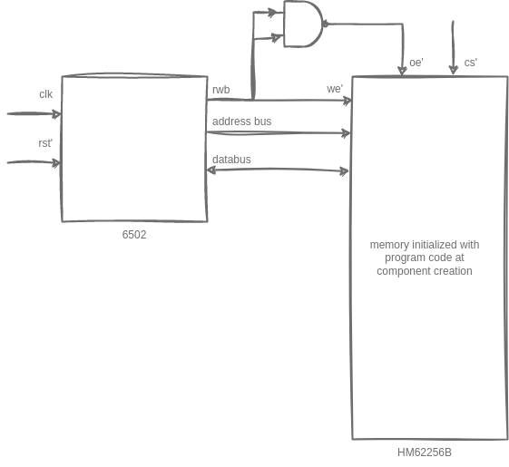

# Computer Architecture Simulator

## Idea:

I was binging Ben Eater's youtube series on ["Build a 65c02-based computer from Scratch"][yt-ben-eater] (see also: https://eater.net/6502) when I realized, a simulation of the shown contents would be a very nice little project to finally learn rust after years!

I read over [rust-book](https://doc.rust-lang.org/book/) and some of the related materials time ago and since then watched conference [talks](https://www.youtube.com/watch?v=yT0cRctyZOE&t=22s) about rust regularly, but still could never come up with a good project to actually use the learned.

> Disclaimer: This simulation is only a toy project and is by no means complete, has no correct timing (w.r.t. cycle correctness of ops) and, therefore, must not be used for production critical scenarios!

> Alternatives: There are other better suited projects to simulate 6502 out there - e.g. [visual6502.org](http://visual6502.org/JSSim/expert.html)


## Components

### CPU - 6502:
* W65C02S 8-bit Microprocessor datasheet: https://www.westerndesigncenter.com/wdc/documentation/w65c02s.pdf
* MOS MCS650X product family: http://bytecollector.com/archive/misc/6500-50A_MCS6500pgmManJan76.pdf
* 6502.org: http://www.6502.org/tutorials/6502opcodes.html#DFLAG

### RAM
* HITACHI HM62256B (256k SRAM): https://eater.net/datasheets/hm62256b.pdf


## Architecture




## Build and run

clone:
```
git clone ...
```


build:
```
cargo build
```

run:
```
cargo run
```

## Links

Ben Eater: "Build a 65c02-based computer from Scratch" - on breadboard: 
* https://www.youtube.com/playlist?list=PLowKtXNTBypFbtuVMUVXNR0z1mu7dp7eH
* https://eater.net/6502

http://visual6502.org/JSSim/expert.html


## Additional material:

* Writing an Operating System for the 6502
https://lambdascheme.com/preempt.html

* Godbolt on 6502 CPU timings
https://xania.org/201405/jsbeeb-getting-the-timings-right-cpu

* http://visual6502.org/JSSim/expert.html


[yt-ben-eater]: https://www.youtube.com/playlist?list=PLowKtXNTBypFbtuVMUVXNR0z1mu7dp7eH